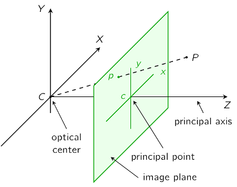

# Camera Models

## Pinhole camera model

The pinhole camera model is the easiest and most commonly used camera model.  It can include multiple parameters, including focal length, camera center pixel, skew, non-square pixels.  Additionally, radial distortion can easily be added to this linear model.

We wish to define a measurement model that explains how a pixels at location $(u,v)$ in the image, which correspond to point $(x,y)$ on the image plane, is illuminated by a point source in the $(X,Y,Z)$ position in the camera frame. Pixels are enumerated from the top left corner of the image, proceeding row-wise to the right, and then down through each row.  The camera frame is  defined as having its origin at the camera center, $x$-axis horizontal and to the right in the image plane, $y$-axis vertical and down in the image plane, and $z$-axis outward from the camera center to the world.

### Focal length model
The focal length defines the location of the image plane relative to the camera centre.  The image plane is often drawn in front of the camera center to eliminate the need to consider with the image inversion that results from the pinhole.  We first define the mapping from a 3D point in the camera frame to a 2D point on the image plane.

By similar triangles, the basic equations are,
\begin{eqnarray}
x & = & \dfrac{fX}{Z}
\end{eqnarray}
\begin{equation}
y = \dfrac{fY}{Z}
\end{equation}
which can be combined into homogeneous equation form as follows,
\begin{equation}
\left[\begin{array}{c} x \\ y \\ z \\ \end{array}\right]
 = \left[\begin{array}{cccc} f & 0 & 0 & 0\\ 0 & f & 0 & 0\\ 0 & 0 & 1 & 0 \\ \end{array}\right]
  \left[\begin{array}{c} X \\ Y \\ Z \\ 1 \\ \end{array}\right]
\end{equation}
Here $ w = Z $, so dividing the set of three equations by $Z$ yields the expected result.

### Conversion to pixels

The above definition for the projection is in a metric space, and can be expressed in units of mm, or inches, for example, as defined by the measure used for the focal length.  To convert to pixels, we need to scale the focal length parameters as follows, which can be different for each axis
\begin{equation}
\left[\begin{array}{c} x \\ y \\ z \\ \end{array}\right]
 = \left[\begin{array}{cccc} m_x f & 0 & 0 & 0\\ 0 & m_y f & 0 & 0\\ 0 & 0 & 1 & 0 \\ \end{array}\right]
  \left[\begin{array}{c} X \\ Y \\ Z \\ 1 \\ \end{array}\right]
\end{equation}

Pixels are numbered from the top-left corner of an image, and so the pixel counts must be adjusted to match the pinhole camera model with origin near the center of the image plane.  This can be done with a simple shift in the image plane, by $(x_0, y_0)$.

\begin{eqnarray}
\left[\begin{array}{c} x \\ y \\ 1 \\ \end{array}\right] &
 = & \left[\begin{array}{ccc} m_x f & 0 & x_0 & 0 \\ 0 & m_y f & y_0 & 0 \\ 0 & 0 & 1 & 0 \\ \end{array}\right]
  \left[\begin{array}{c} X \\ Y \\ Z \\ 1 \\ \end{array}\right] \\
& = & \left[\begin{array}{ccc} \alpha_x & 0 & x_0 & 0 \\ 0 & \alpha_y f & y_0 & 0 \\ 0 & 0 & 1 & 0 \\ \end{array}\right]
  \left[\begin{array}{c} X \\ Y \\ Z \\ 1 \\ \end{array}\right] \\
\end{eqnarray}

Lastly, sometimes a skew parameter is added to account for non-orthogonal x-y axes in the image.
\begin{eqnarray}
\left[\begin{array}{c} x \\ y \\ 1 \\ \end{array}\right]  
& = & \left[\begin{array}{ccc} \alpha_x & s & x_0 & 0 \\ 0 & \alpha_y f & y_0 & 0 \\ 0 & 0 & 1 & 0 \\ \end{array}\right]
  \left[\begin{array}{c} X \\ Y \\ Z \\ 1 \\ \end{array}\right] \\
\end{eqnarray}

From this definition of the intrinsic projection of feature points to the pixels in the image plane, we define the camera intrinsic matrix, $K$, as follows,

\begin{equation}
K  =  \left[\begin{array}{ccc} \alpha_x & s & x_0 & 0 \\ 0 & \alpha_y f & y_0 & 0 \\ 0 & 0 & 1 & 0 \\ \end{array}\right]
\end{equation}

## Distortions to the pinhole model

### Radial-Tangential Distortions
Many models for radial and tangential distortions, to be included.

One oft used variant is also known as  the atan camera model. Defined in "Straight Lines have to be Straight," 2001.

## General Camera Models

Switch from projection through a single point to mapping from unit sphere to image plane.  This can handle rays from anywhere.

### Taylor Camera Model
Purely parametric model, just curve fit n-order polynomials in forward and reverse

Defined in Scaramuzza Thesis

### Unified Camera model

Parametric in one direction, invertable to get reverse. Used in Camodocal.

Defined in Single View Point Omnidirectional Camera Calibration from Planar Grids

### Generic Camera model

Totally generic method that might be used in Kalibr

Defined in A Generic Camera Model and Calibration Method for Conventional, Wide-Angle, and Fish-Eye Lenses

## Summary

Good survey of geometric (as opposed to purely numerical) camera models.  "Camera Models and Fundamental Concepts Used in Geometric Computer Vision"
